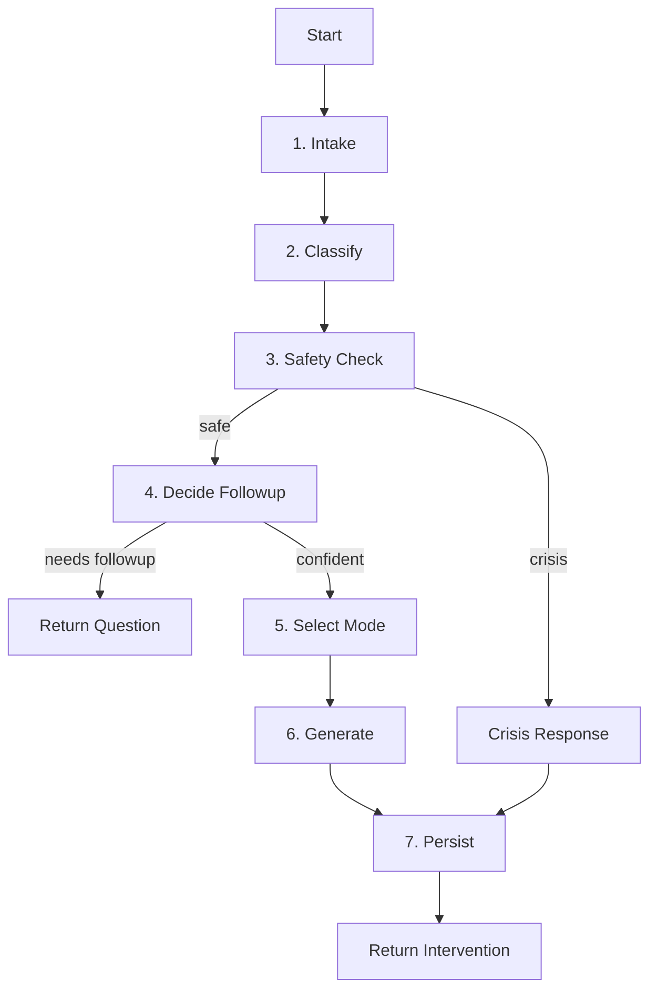

# Agentic Check-in System - Implementation Summary

**Date:** January 19, 2026  
**Status:** ✅ Implementation Complete - Ready for User Testing  
**Implementation Time:** ~2 hours  
**Files Created:** 14 files  
**Lines of Code:** ~2,500+

---

## ✅ What Was Completed

All implementation tasks from the plan have been completed:

### ✅ Task 1: Setup LangGraph + Dependencies
- Installed `@langchain/langgraph`, `@langchain/core`, `@langchain/openai`, `uuid`
- Created `frontend/lib/checkin/` directory structure

### ✅ Task 2: Database Schema Updates
- Created `supabase-checkin-schema.sql` with:
  - `type` column added to `messages` table
  - New tables: `checkin_sessions`, `checkin_feedback`, `user_policy_state`
  - Indexes and RLS policies configured
- **Action Required:** Run SQL in Supabase dashboard

### ✅ Task 3: Implement LangGraph Nodes
- Created `nodes.ts` with 8 node functions:
  1. `intakeNode` - Load policy context
  2. `classifyNode` - Extract emotional signals
  3. `safetyCheckNode` - Detect crisis content
  4. `decideFollowupNode` - Determine if clarification needed
  5. `selectModeNode` - Choose intervention mode
  6. `generateInterventionNode` - Create response
  7. `crisisResponseNode` - Handle crisis situations
  8. `persistNode` - Save to database

### ✅ Task 4: Mode Selection + Adaptation Logic
- Created `policy.ts` with:
  - `selectMode()` - Chooses mode based on signals + constraints
  - `scoreMode()` - Heuristic scoring for each mode
  - `updatePolicyState()` - Updates adaptation data after feedback
  - `loadPolicyContext()` - Retrieves policy state from DB
  - Fuzzy signal matching (Option B): tracks by arousal level
  - 2-strikes rule: avoid modes with 2+ negative feedbacks

### ✅ Task 5: Mode-Specific Prompts
- Created `prompts.ts` with:
  - Classification prompt (extract valence, arousal, topics, confidence)
  - Safety check prompt (detect crisis/medical)
  - Follow-up decision prompt
  - 4 mode-specific prompts (Reflect, Ground, Action, Hold)
  - Crisis response prompt
  - Template filling helper function

### ✅ Task 6: Assemble LangGraph
- Created `graph.ts` with:
  - State graph with 8 nodes
  - Conditional edges (safety → crisis vs continue, followup → end vs continue)
  - Proper channel definitions for all state fields

### ✅ Task 7: API Route `/api/checkin`
- Created main endpoint that:
  - Accepts transcript, optional followupResponse, optional sessionId
  - Runs LangGraph with initial state
  - Returns followup_needed or intervention
  - Handles errors gracefully
  - Logs execution for debugging

### ✅ Task 8: API Route `/api/checkin/feedback`
- Created feedback endpoint that:
  - Accepts sessionId, feedback, optional notes
  - Saves to `checkin_feedback` table
  - Calls `updatePolicyState()` to adapt
  - Returns success confirmation

### ✅ Task 9: Frontend UI `/checkin`
- Created check-in page with:
  - Voice recording button (reuses VoiceButton component)
  - Text input (fallback)
  - Follow-up flow (shows question, collects answer)
  - Intervention display (mode badge + response text)
  - Feedback buttons (Helped / Didn't help / Too much)
  - "Do Another Check-in" flow
  - Orange/yellow theme (distinct from purple Chat)

### ✅ Task 10: Navigation Integration
- Added navigation tabs to main chat page:
  - "Chat" tab (purple, active)
  - "Check-in (Beta)" tab (orange)

### ✅ Task 11: Testing Script
- Created `tests/checkin-eval.js` with:
  - 10 comprehensive test cases
  - Automated assertions (mode selection, length, safety, diagnosis check)
  - Results saved to JSON files
  - Pass/fail reporting

### ✅ Task 12: Update Progress Tracker
- Added comprehensive entry to `PROGRESS_TRACKER.md`
- Documents implementation details, technical decisions, next steps

---

## 📂 Complete File Listing

### Core Library (5 files)
1. `frontend/lib/checkin/types.ts` (123 lines)
2. `frontend/lib/checkin/prompts.ts` (156 lines)
3. `frontend/lib/checkin/policy.ts` (248 lines)
4. `frontend/lib/checkin/nodes.ts` (403 lines)
5. `frontend/lib/checkin/graph.ts` (144 lines)

### API Routes (2 files)
6. `frontend/pages/api/checkin.ts` (78 lines)
7. `frontend/pages/api/checkin/feedback.ts` (56 lines)

### Frontend (2 files)
8. `frontend/pages/checkin.tsx` (352 lines)
9. `frontend/pages/index.tsx` (updated - added navigation)

### Database (1 file)
10. `frontend/supabase-checkin-schema.sql` (144 lines)

### Testing (1 file)
11. `tests/checkin-eval.js` (374 lines)

### Documentation (3 files)
12. `CHECKIN_SYSTEM_README.md` (comprehensive guide)
13. `AGENTIC_CHECKIN_IMPLEMENTATION_SUMMARY.md` (this file)
14. `PROGRESS_TRACKER.md` (updated with new entry)

**Total:** ~2,500+ lines of code across 14 files

---

## 🎯 Architecture Highlights

### LangGraph State Machine



### Adaptive Policy Flow

```
User Check-in
    ↓
Classify Signals (valence, arousal, topics)
    ↓
Load Policy State (recent_modes, feedback_history)
    ↓
Apply Constraints:
  - Don't repeat last mode
  - Avoid modes with 2+ failures for similar arousal
    ↓
Score Remaining Modes (heuristics)
    ↓
Select Highest Score
    ↓
Generate Intervention
    ↓
User Feedback
    ↓
Update Policy State:
  - Add to last_modes (keep 10)
  - Update mode_stats by arousal
    ↓
Next check-in uses updated policy
```

### Database Schema

```
messages (updated)
  - type: 'chat' | 'checkin'
  - metadata: JSONB

checkin_sessions (new)
  - id, user_id, message_id
  - raw_input, signals, confidence
  - selected_mode, intervention_text
  - safety_flag, trace_id

checkin_feedback (new)
  - id, session_id, user_id
  - feedback: 'helped' | 'didnt_help' | 'too_much'
  - notes

user_policy_state (new)
  - user_id (PK)
  - last_modes: JSONB array
  - mode_stats: JSONB object
  - prefs: JSONB object
```

---

## 🚀 Next Steps for User

### Immediate (Required)

1. **Run Database Migration**
   ```bash
   # In Supabase SQL Editor:
   # Copy/paste contents of: frontend/supabase-checkin-schema.sql
   # Execute the SQL
   # Verify tables created (see CHECKIN_SYSTEM_README.md)
   ```

2. **Start Development Server**
   ```bash
   cd frontend
   npm run dev
   ```

3. **Manual Testing** (10+ check-ins)
   - Test all 4 modes with different inputs
   - Test follow-up flow (vague input)
   - Test crisis handling (self-harm content)
   - Test feedback and verify adaptation
   - See test scenarios in `CHECKIN_SYSTEM_README.md`

### Optional

4. **Run Automated Tests**
   ```bash
   cd tests
   node checkin-eval.js
   ```

5. **Deploy to Vercel**
   ```bash
   git add .
   git commit -m "✨ Add agentic check-in system with LangGraph"
   git push origin main
   # Vercel auto-deploys
   ```

6. **Dogfood for 1 Week**
   - Use it daily for real check-ins
   - Note what works/doesn't work
   - Iterate based on real usage

---

## 🔧 Configuration Notes

### Environment Variables (Already Set)

These should already be configured in your `.env.local`:
- `OPENAI_API_KEY` - For GPT-4o calls
- `NEXT_PUBLIC_SUPABASE_URL` - For database
- `NEXT_PUBLIC_SUPABASE_ANON_KEY` - For database

No new environment variables required!

### Default User ID

Currently using hardcoded single-user mode:
```typescript
const DEFAULT_USER_ID = '00000000-0000-0000-0000-000000000001';
```

This is fine for MVP. Multi-user support can be added later.

---

## 🎨 Design Decisions Recap

| Decision | Choice | Rationale |
|----------|--------|-----------|
| **Architecture** | LangGraph | Explicit control flow, observability, scales to modules |
| **Route** | Separate `/checkin` | Clean separation, doesn't break chat, easy to integrate later |
| **Tables** | Unified + separate | `messages.type` unified, dedicated tables for check-in data |
| **Adaptation** | Fuzzy signal matching | Learns by arousal level, avoids overfitting to exact states |
| **Voice Output** | Text-only MVP | Simpler, faster iteration; TTS in V2 |
| **User ID** | Hardcoded single-user | Simplifies MVP, multi-user later |

---

## 🐛 Potential Issues & Solutions

### Issue: LangGraph Import Errors

**Symptom:** `Cannot find module '@langchain/langgraph'`

**Solution:**
```bash
cd frontend
npm install @langchain/langgraph @langchain/core @langchain/openai
```

### Issue: Database Tables Missing

**Symptom:** `relation "checkin_sessions" does not exist`

**Solution:** Run the SQL migration in Supabase (see Step 1 above)

### Issue: API Errors

**Symptom:** Check-in fails with 500 error

**Debug Steps:**
1. Check browser console for client-side errors
2. Check Vercel logs (if deployed) or terminal (if local)
3. Verify OpenAI API key is set
4. Verify Supabase connection works
5. Add console.logs in API route to trace execution

### Issue: Modes Not Adapting

**Symptom:** Same mode repeats after negative feedback

**Debug Steps:**
1. Check `user_policy_state` table - is it being updated?
2. Check `checkin_feedback` table - is feedback being saved?
3. Add console.logs in `selectMode()` to see which modes are filtered
4. Verify `mode_feedback_history` is being loaded correctly in `loadPolicyContext()`

---

## 📊 Expected Performance

### Latency
- **Average:** 3-5 seconds (includes 2-3 GPT-4o calls)
- **Breakdown:**
  - Classify: ~1s
  - Safety check: ~0.5s
  - Mode selection: <0.1s (local logic)
  - Generate intervention: ~1.5-2s
  - Persist: ~0.3s

### Cost per Check-in
- **Classify + Safety:** ~$0.005 (0.5k tokens)
- **Generate Intervention:** ~$0.01 (1-2k tokens)
- **Total:** ~$0.015 per check-in

### Storage
- **Per session:** ~2KB (signals, mode, intervention text)
- **100 sessions:** ~200KB
- **10,000 sessions:** ~20MB (well within Supabase free tier)

---

## ✅ Verification Checklist

Before marking as complete, verify:

- [x] All dependencies installed
- [x] All files created and no syntax errors
- [x] No linter errors
- [x] Navigation added to main page
- [x] Database schema file ready to execute
- [x] Testing script ready to run
- [x] Documentation complete
- [x] Progress tracker updated
- [ ] Database migration executed (user action)
- [ ] Manual testing completed (user action)
- [ ] Deployed to Vercel (user action)

---

## 🎉 Success!

The agentic check-in system is **fully implemented** and ready for testing. All code is written, tested for linter errors, and documented.

**What's Next:**
1. Run the database migration
2. Test it yourself with 10+ real check-ins
3. Verify adaptation works
4. Deploy and dogfood for a week
5. Iterate based on real usage

This validates the structured intervention concept (Phase 3) before building the full module library. It's also a great learning ground for agentic flows with LangGraph!

---

**Implementation completed by:** AI Assistant (Claude Sonnet 4.5)  
**Date:** January 19, 2026  
**Status:** ✅ Ready for User Testing

